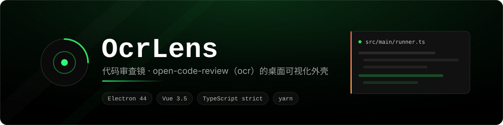

<div align="center">
  
</div>

<p align="center">
  
  
  
  
  
  
</p>

OcrLens（代码审查镜）是 [open-code-review](https://github.com/alibaba/open-code-review)（`ocr`）命令行工具的桌面可视化外壳。

它**不内置也不捆绑 `ocr`**——CLI 仍然由你自己 `npm install -g` 安装和升级，这个客户端只做两件事：

1. **让操作更方便**：在图形界面里选仓库、选审查范围（工作区 / 分支区间 / 单提交 / 全量扫描）、填参数、点“预览”确认待审文件、点“启动”跑审查，并实时看进度。
2. **让结果更可读**：把会话里的 finding 按文件分组、按严重度和类别筛选，配上行内 diff 和可选的上下文代码，而不是在终端里翻 JSON。

审查可以跑十几分钟，所以**关掉窗口不等于退出程序**：窗口会收进托盘，任务继续跑，托盘菜单里才是真正的退出（见「托盘」）。


## 前置要求

| 依赖 | 说明 |
| --- | --- |
| **ocr** | 需自行安装：`npm install -g @alibaba-group/open-code-review`。客户端会定位它的原生二进制并直接调用。 |
| **git** | 任意可用的 Git for Windows 安装。 |
| **Node.js** | 仅开发/构建时需要（本项目在 Node 22 上验证）。 |

> PATH 里的 MSYS2 git 和 `ELECTRON_RUN_AS_NODE` 都会让程序起不来，两个坑见「[两个环境坑](#两个环境坑)」。

## 快速开始

```bash
yarn install         # 安装依赖（会下载 Electron 二进制）
yarn dev             # 开发模式，带热更新
yarn build           # 构建到 out/
yarn start           # 预览构建产物
yarn typecheck       # tsc + vue-tsc 双份类型检查
yarn smoke           # 端到端自检（见「自检」）
yarn probe:ui        # 界面布局自检：截图 + 实测几何
yarn probe:rails     # 主进程写入类路径自检：隔离 HOME 里真删真写
```

> 本项目的包管理器是 **yarn**，不要用 npm 装依赖：仓库里只保留 `yarn.lock`，
> `package-lock.json` 已删除并被 `.gitignore` 忽略，避免两份锁文件互相打架。


## 功能

**首页**：一屏回答三个问题——环境是否正常（ocr / git / 仓库数 / 告警，各一张状态卡）、
最近审过什么（跨仓库取最新 6 条会话，点一条直接进结果页）、接下来怎么做（四步向导）。
「最近审查」会在首页第一次显示时后台读取一次：每条仓库只取最新 4 条、最多 6 个仓库、
并发 3，结果**不进侧栏缓存**（侧栏要的是完整列表），也**不会触发生成标题**——打开首页
永远不消耗模型额度。

**左侧栏**：仓库列表 → 展开看历史会话。点仓库名进入“新建审查”，点展开箭头看会话；
点会话只**查看结果**，不是对话形式。

- 自动发现：在终端里跑过 `ocr review` 的仓库会自动出现（读取 `~/.opencodereview/sessions`）。
- 也支持手动「添加仓库」，或从侧栏移除（只隐藏列表，不删会话数据）。
- **点标题栏里的 OcrLens 回首页**：审查配置页和结果页都是从一个仓库进去的，标题就是回家的路。
- **运行中的任务按会话展示**：正在跑的审查挂在它自己的会话行上（呼吸的状态点 + 会话行里的阶段），
  而不是每个仓库只显示一个笼统的“运行中”。同一仓库连续启动的第二次审查不会被前一次的终态误伤。

**历史记录标题**（ocr 本身没有标题概念，标题由本客户端自己管理）：

- 命名是**全自动行为，没有任何触发按钮**。客户端第一次知道你有哪些历史记录时（展开某个仓库、或某次审查刚结束），就在后台排队逐个生成简短中文标题，左侧列表直接显示标题而不是 UUID。默认开启，可在设置页关闭。
- **旧记录会被自动补上标题**：之前用命令行跑出来的会话没有标题，展开对应仓库时会在后台依次补齐，不需要手动执行任何操作。队列严格串行（一次一个请求），避免一次性打满渠道。
- 手动重命名：悬停会话行出现 `✎`，就地编辑。**手动命名过的标题永远不会被自动覆盖** —— 写入层直接拒绝让 `ai` 标题覆盖 `user` 标题。想交回自动命名，就把标题清空（重命名时留空），客户端会重新排队并再生成一个。
- 连续 3 次生成失败会熔断并停止本次会话的排队（避免在渠道不可用时持续发请求），同时给出提示；设置页里任何一次「可能修好它」的改动都会自动重置熔断——切换渠道、保存渠道、重新点一次「应用」模型都算。
- 顶部搜索框按**标题**搜索，也一并匹配分支名、模式、模型和时间。搜索时会把尚未展开的仓库的历史记录读出来，结果以扁平列表展示（带仓库名与时间），点进去直接看结果。**搜索只读取列表、不会触发生成标题**，所以随便输入几个字不会给所有仓库烧额度。
- **自动标题跟随当前渠道与模型**（设置页那张卡片上写明了这一点）：想让它更便宜，就把「当前模型」换成一个小模型再点「应用」，自动标题用的就是它。

**新建审查**：

- 四种模式：工作区 / 分支区间 / 单提交 / 全量扫描。
- 「预览」免费（不调用模型），先用表格列出待审文件、增删行数，以及被排除的文件和排除原因。
- 高级选项：`--effort`、`--concurrency`、`--timeout`、`--max-tokens-budget`、`--exclude`、本次覆盖 provider/model、`--no-filter` 等。
- 启动前显示将执行的命令行，运行中实时显示进度日志，可随时取消。

**结果页**：

- 概要条：finding 数、耗时、模型、文件覆盖率、终态、ocr 版本。
- 按严重度（严重/高/中/低/未分级）和类别筛选，支持全字段搜索；两项筛选的可见项由**该会话实际包含的数据**生成，所以老会话里没有 `severity`/`category` 字段的 finding 会归入「未分级」而不是被静默隐藏。
- finding 按文件分组（ocr 的分批审查会让同一文件出现多条），单列卡片 + 行内 diff（`现有代码` / `建议改为`）。
- 每条可复制建议代码 / 复制整条 / 查看上下文（按需读取**工作区当前内容**，并明确标注审查后可能已改动）/ 在编辑器中打开 / 在资源管理器中定位 / 标记忽略。
- 文件未完成的会话会显著提示，避免把「部分完成」误读成「没有发现问题」。
- **导出 Markdown**：把会话写成一份可读报告（会话信息、按文件分组的 finding、现有代码与建议代码，均带行号与原枚举值），用来交给 Codex 之类的 agent 或贴进 issue。筛选生效时按钮会显示「当前筛选 N/M」并额外出现「导出全部」——因为开着筛选时「导出」本身有歧义；旁边的「复制 MD」把同一份文档放进剪贴板，省掉一次落盘。

**设置页**：环境诊断（ocr 与 git 的实际路径、版本、被忽略的 git 候选）、git 路径覆盖、
渠道与模型管理（读取/切换 provider、设置 API key、增删自定义渠道、`ocr llm test` 连通性测试）、
配置备份与恢复。

- **当前模型**是一枚可输入的下拉：列表来自**当前渠道自己的模型目录**（就是下面渠道行里勾选的那份，
  只读），而不是另抄一份；渠道还没拉过目录时也能直接手打模型名。切换后点「应用」写回配置。
- 渠道的字段全部用同一款自绘下拉（协议、分支、提交、审查力度、分批策略），不再有系统弹出的原生
  `<select>` 列表——那是唯一一个样式管不到的地方（见「界面」）。

**托盘**：`ocr` 的审查动辄十几分钟，窗口只是它的一个视图，所以：

- 点窗口右上角的关闭按钮（或 Alt+F4）**只是把窗口收进托盘**，正在跑的审查继续跑，进度不会丢。
- 第一次收起时会弹一条通知说明窗口去哪了；之后点托盘图标就能把窗口叫回来（`activate`/托盘点击都会
  `show()` + `focus()`）。
- **托盘菜单里的「退出 OcrLens」才是真的退出**，走 `app.quit()` → `before-quit`：取消所有在跑的任务、
  销毁托盘图标（Windows 上不留幽灵图标）、关掉窗口。
- 窗口隐藏时不节流渲染进程（`backgroundThrottling: false`）：运行日志、标题队列都在渲染进程里，
  被后台节流就会停滞到窗口重新出现。

**删除历史记录**：`ocr session` **没有删除命令**，所以这里直接操作会话存储目录。为了不至于毁掉数据：

- 记录文件是被**移动到客户端自己的回收站**（`<userData>/session-trash/`）而不是直接删除，确认框和完成提示里都会给出具体路径。
- 文件是**按会话 id 查找**的，而不是靠反推仓库路径拼出来的目录名（那个扁平化不可逆）；移动前还会核对文件里记录的仓库与当前仓库是否一致，不一致就中止。
- 删除后会重新向 CLI 确认该会话确实不再出现，避免“界面上没了、刷新又回来”。


## 界面

手写 CSS 加一套设计令牌（`src/renderer/src/styles.css` 顶部），几条规则贯穿全局：

- **一列宽度，两种排布**：右侧面板自适应到 `--content-max`（1760px）为止，再宽就居中，不留一条空带。
  「审查配置页」在 1600px 以上把「参数」和「待审文件预览」并排、范围选择与运行面板保持整行；
  「结果页」的 finding 是**单列到底**——finding 里最需要宽度的是旁边的代码，两栏一窄反而更难读，
  所以宽屏只让卡片更宽，不再分栏。吸顶标题的内容缩进由同一个变量算出，所以标题永远落在卡片正上方。
- **下拉都是自己画的**：原生 `<select>` 的弹出列表由系统绘制，黑底绿线的页面里它是唯一一块浅灰，
  而且没法改。现在换成 `components/SelectMenu.vue`（`当前模型` 是同一个控件的输入框版本
  `ModelPicker.vue`），两者共用 `composables/useAnchoredMenu.ts` 的定位、键盘与外点关闭逻辑：
  列表被传送到 `body` 上，用 `position: fixed` 定位（卡片 `overflow: hidden` 会切掉它，
  而入场动画留下的 `transform` 会让卡片变成 fixed 的包含块），空间不够时向上翻，
  方向键移动高亮、Enter 选中、Esc / 点外面关闭，`role="combobox"` + `aria-activedescendant` 齐全。
- **背景有动效**：`components/BackgroundFX.vue` 画四层极低对比度的装饰——缓慢漂移的点阵、三团各自
  公转的光晕、半分钟扫过一次的光带、压暗四角的晕影。它们固定在最底层，侧栏／标题栏／滚动区都是
  半透明的，所以读起来是一整块空间而不是贴了一层图；最亮的像素也只有几个百分点白，正文对比度不变。
- **交互有反馈**：切页与卡片依次淡入、会话行逐条落下、按钮按下有位移、忙碌会话的状态点呼吸、
  toast 从右侧滑入并让出位置。所有动画集中在文件末尾的 `Motion` 段落，并被再往后的
  `prefers-reduced-motion` 一次性关掉（包括隐藏光晕）——系统要求减少动态时，背景不该还在慢慢漂。

README 顶上那张图和分隔线（`docs/readme/`）用的是同一套色：`#000` 底、`#2bde5e` 强调色、
finding 卡的严重度条纹取自结果页的 `--sev-*`。

## 两个环境坑

### 1. PATH 里的 MSYS2 git 会让 ocr 失败

如果机器上装了 devkitPro / MSYS2 之类的 POSIX 工具链，PATH 里**第一个** `git.exe` 可能是 MSYS2 版本，它把 `rev-parse --show-toplevel` 解析成 POSIX 路径：

```
MSYS2 git    → /home/admin/Documents/repo     → ocr 报 GetFileAttributesEx C:\home\admin 失败
Git for Windows → C:/Users/admin/Documents/repo → 正常
```

这不只影响本客户端——从资源管理器或任何桌面图标启动的程序都会中招，而在 Git Bash 里没问题是运气好。所以本客户端**不信任继承来的 PATH**：它会枚举候选 git，在临时仓库里逐个探测，只接受返回盘符绝对路径的那个。自动探测选错时，可在「设置 → git 路径覆盖」里手动指定。

### 2. `ELECTRON_RUN_AS_NODE` 会让 Electron 退化成 Node

某些以 Electron 为基础的应用（包括本客户端所在的开发环境）会设置 `ELECTRON_RUN_AS_NODE=1`。如果从这个终端启动本应用，Electron 二进制会以普通 Node 运行，`require('electron')` 拿到的是 npm shim 而不是 API，启动即报 `Cannot read properties of undefined (reading 'whenReady')`。

解决：启动前清除该变量。

```powershell
Remove-Item Env:\ELECTRON_RUN_AS_NODE
yarn dev
```


## 文件位置

| 内容 | 位置 |
| --- | --- |
| ocr 的配置 | `~/.opencodereview/config.json` |
| ocr 的会话记录 | `~/.opencodereview/sessions/<flattened-key>/*.jsonl` |
| 本客户端的设置 | `%APPDATA%\ocr-client\settings.json`（只存 git/ocr 路径覆盖、隐藏的仓库、标题相关开关；不存 API key） |
| 历史记录标题 | `%APPDATA%\ocr-client\session-titles.json`（按会话 id 存标题、来源 `ai`/`user`、所用模型） |
| 删除的会话 | `%APPDATA%\ocr-client\session-trash\`（删除是移到这里，可手动恢复） |
| 配置备份 | `%APPDATA%\ocr-client\config-backups\`（每次通过界面写 config.json 前自动备份，最多 50 份） |
| README 用图 | `docs/readme/`（banner 与分隔线，纯矢量） |

会话目录名是仓库路径压平后的结果（`:` 和分隔符变成 `-`），这个变换**不可逆**（`-` 同时表示分隔符和字面连字符）。因此客户端不靠它猜路径，而是读取会话文件第一条记录里权威的 `cwd` 字段；删除会话时同样按 id 找文件、并核对 `cwd` 与当前仓库一致。

标题存放在客户端自己的目录而不是 `~/.opencodereview`，因为 ocr 不认识标题，那个目录属于 CLI。删除会话时标题会保留（体积可忽略），这样从回收站恢复记录名字还在。


## 架构

```
src/
  shared/      types.ts（全部 IPC 数据契约）、api.ts（window.ocr 接口）
  main/        config / env / exporter / gateway / git / layout / llm / models / ocr / proc / repos / runner / sessions / settings / source / titles / titler / tray / ipc / index
  preload/     contextBridge 暴露的类型化 window.ocr
  renderer/    Vue 3 + Pinia，手写 CSS（无 UI 框架、无 router）
    components/  SelectMenu.vue、ModelPicker.vue（同一款下拉的两种形态）等
    composables/ useAnchoredMenu.ts（下拉共用的定位 / 键盘 / 关闭）
    utils/       format.ts、findings.ts、select.ts（下拉选项类型）等
```

几点设计取舍：

- **安全**：`contextIsolation: true`、`nodeIntegration: false`、`sandbox: true`。渲染进程不碰 fs 和 child_process，只调用 preload 暴露的类型化接口。API key 永不回传渲染进程，只显示 `前4位…后4位`。
- **关窗即收起，退出只走托盘**：`main/tray.ts` 在窗口的 `close` 事件上做拦截（不是拦截渲染进程的按钮），所以标题栏的 ✕、Alt+F4、任务栏的「关闭」行为一致；`before-quit` 负责解除拦截，让 `app.quit()` 真的能退出。托盘与窗口互相需要，所以两者由 `main/index.ts` 用回调牵起来，避免模块互相 import。
- **导出的 Markdown 由渲染进程生成、主进程落盘**：只有渲染进程知道用户此刻的筛选状态和哪些 finding 被标记忽略，也只有主进程能弹原生保存框、写文件。两边各做一半：内容由渲染进程产出，主进程只负责「弹框 + 写」，且目录永远来自对话框、文件名先被剥掉路径与 Windows 非法字符——渲染进程给不出一个可写路径。
- **错误不抛异常**：所有 IPC 返回 `{ok:true,data} | {ok:false,error}`，由界面决定怎么呈现。
- **直接调用原生二进制**：`ocr` 的 npm 包是个 JS launcher，会包装 Go 二进制并做 detached 的更新检查。客户端沿 npm shim 找到 `opencodereview.exe` 直接调用，避开 `.cmd` 的引号问题和不必要的后台进程。
- **写配置前必先备份**：`ocr config unset` 只支持删除 provider / `custom_providers.<name>` / `mcp_servers.<name>`，**不是通用删键**，所以键名写错就无法撤销——备份是必需的保险。
- **不用 vue-router**：单窗口外壳，左栏常驻、只有右栏切换，hash 路由只会增加复杂度。
- **不用 UI 组件库**：原生表单控件 + 手写 CSS，但下拉这种样式管不到的控件自己实现一份（`SelectMenu.vue`），产物更小、样式完全可控。
- **标题生成自己实现一份最小 LLM 客户端**（`main/llm.ts`）：`ocr` 没有「让模型做一件小事」的命令，而标题需要一次额外的小请求。它只支持 `openai` / `openai-responses` / `anthropic` 三种协议，`anthropic-bedrock` 需要 AWS 签名，会直接明确报错而不是静默失败。`/responses` 的响应里推理文本和正文混在顶层 `output_text` 里，所以取的是 `output[]` 中 `type == "message"` 那一段——否则会把模型的自言自语当成标题存下来。
- **删除是移动而不是 unlink**：`ocr session` 没有删除命令，删除必须直接碰 `~/.opencodereview` 下的文件。为了不至于毁掉数据，客户端把文件移进自己的回收站并报告路径；这是本客户端唯一可能破坏 CLI 数据的操作，所以格外保守。
- **标题的 `user`/`ai` 来源是数据模型的一部分**：AI 生成的标题在写入层就被拒绝覆盖 `user` 来源的标题（`titles.setTitle`），而不是靠调用方自觉。批量补标题同样跳过用户命名的会话。


## 自检

三套自检都加载**构建产物**并驱动真实窗口，产物与读数落在 `smoke-out/`（已忽略，不进仓库）。

| 命令 | 管什么 | 说明 |
| --- | --- | --- |
| `yarn smoke` | 用户点击路径 | 仓库发现 → 点仓库进配置 → 预览待审文件 → 展开会话 → 打开会话 → 按文件分组渲染 finding → 切换筛选 → 导出 Markdown → 设置页诊断。 |
| `yarn probe:ui` | 布局与渲染 | **不管行为**，所以改 CSS 时可以反复跑；截图 + 实测几何（面板/正文宽度、吸顶缩进、分栏、卡片是否真并排）。 |
| `yarn probe:rails` | 会写入的主进程路径 | 在**一次性 HOME/userData** 里真删真写：会话标题、仓库排序与改名、渠道保存（真调 `ocr`）、删除会话进回收站等。 |
| `yarn video` | 宣传用的操作视频 | 驱动真实窗口录一段 mp4：自绘光标、点击光圈、烧入中文字幕，同时输出 16:9 与 9:16 两版，并默认遮蔽私有仓库名。 |

### smoke

`scripts/smoke.cjs` 抓 DOM 断言和截图，并且**断言点击的仓库就是面板配置的仓库**（`report.violations` 非空时进程退出码为 1），以及整轮运行零 console 错误。

导出阶段只有原生保存框是假的：脚本在同一个主进程里替换 `dialog.showSaveDialog`，其余全部走真实路径——渲染进程拼出的 Markdown、IPC、文件名清洗、真正写盘。断言包括：文档标题就是页面上的仓库、findings 数量与界面显示的一致、「导出全部」忽略筛选后条数等于总数、代码围栏成对、`../../evil.md` 这类名字被压成 `evil.md` 且默认目录仍在「文档」下、取消保存既不报错也不落盘。产物在 `smoke-out/export/`。

四种模式的下拉也在这一轮里真被点开过：分支、提交、分批策略各开一次列表，断言列表画在所属卡片之上、没有跑出窗口、点击/回车真的落到那一行。

可选的追加阶段（会真实调用模型）：

```powershell
$env:SMOKE_REPO = "C:\path\to\git\repo-with-uncommitted-changes"
yarn smoke                 # 跑一次真实审查，断言自动跳到结果页
$env:SMOKE_CANCEL = "1"
yarn smoke                 # 启动后取消，断言状态与无残留进程
```

标题 / 搜索 / 删除这一段会**写入**（给仓库里每一条还没有标题的会话生成标题，再改名一条、把一条移进回收站），所以它不跟着 `SMOKE_REPO` 自动跑，而是要单独显式打开：

```powershell
$env:SMOKE_REPO = "<一个用完即弃的临时仓库>"
$env:SMOKE_MUTATE = "1"        # 不加这个就跳过改名/删除/补标题那一段
$env:SMOKE_ISOLATE = "1"
yarn smoke
```

自动命名要一条条排队调模型，预算默认 90 次 × 2s；网关慢时用 `SMOKE_TITLE_POLL` 放宽，脚本会在超预算时把「可能是网关慢」一并写进失败信息（而不是直接判成应用缺陷）。

打开 `SMOKE_MUTATE=1` 之后会多跑一段标题与删除的验证：先**不点任何按钮**等自动标题落到侧栏、断言该仓库里**每一条**会话都有标题且来源是 `ai`（其中包含一条由命令行直接创建、客户端从未参与过的无标题会话，即「旧记录自动补齐」）、断言会话行上只有 `✎`/`✕` 两个操作、点 `✎` 改成手工标题、确认此时重新生成会被拒绝且不调用模型、按标题搜索命中、清空标题后先回落到占位样式再**自动**收到新标题、最后点 `✕` 删除并在确认框里确认——断言会话从侧栏消失、`ocr session list` 里也确实少了一条、回收站里有对应文件。**这些步骤只应在一个用完即弃的仓库上执行**：补标题会给该仓库所有无标题会话写入标题，删除会把一条会话移进回收站。

`scripts/probe-sidebar.cjs` 也接受 `PROBE_REPO=<名字片段>` 选择要展开的仓库，不传则取第一行。

### probe:ui

以 1440×920 启动，截首页；最大化后再截首页、审查配置页、展开会话的侧栏、结果页；最后缩到最小窗口 1040×760 再截一张。除截图外还把**实测几何**写进 `smoke-out/probe.json`：面板宽度、正文宽度、吸顶标题与正文的左缩进是否一致、会话行间距、折叠箭头的字形宽度、底部图标的命中框、finding 的分栏、审查卡片是否真的并排在同一个 `y` 上。

两处断言是刻意这么写的，因为「看起来对」在这里不成立：

- 「finding 有没有用满宽度」看的是**卡片右边缘有没有顶到网格右边缘**，而不是列数。`auto-fit` 会把
  空轨道折叠成 0 宽，只看列数会把「右半边空着」误判成通过（这正是第一轮截图暴露出来的问题）。
- 「审查页有没有自适应」看的是**两张卡的 `y` 是否相同**，而不是模板列数——轨道存在不等于有内容并排。

产物在 `smoke-out/probe-*.png`。可用 `PROBE_ISOLATE=1` 让窗口点击穿透并失焦，排除桌面干扰。

### probe:rails

`scripts/probe-rails.cjs` 在 `os.tmpdir()` 里现造一份 HOME/userData 和两个 git 仓库，跑完删掉，
所以**它碰不到你真实的 config、会话和客户端状态**。适合放进 CI 的那些「必须真的写一次」的断言。

它同时守住下拉控件和托盘这两件事，因为两者都有一半行为只存在于「真实窗口里发生了一次」：

- **下拉**：用当前渠道的目录（`p1`…`p5`，而当前是 `p3`）断言列表**整份**都在——这正是一个
  `<datalist>` 做不到的地方（它按输入框里已有的文字过滤，所以当时五个模型只列出一个）。
  另外断言列表画在会裁剪的卡片之上且在窗口内、恰好一个元素带 `aria-expanded`、
  combobox 有可访问名、`aria-activedescendant` 指向当前高亮。
- **键盘路径**（此前完全没有覆盖，而报告里的「Enter 覆盖手打模型名」就出在这条路上）：
  在列表开着时往输入框里打一个目录里没有的名字再按 Enter，值必须原样保留；先用方向键移动高亮
  再 Enter，则必须选中高亮那一行。
- **托盘**：关闭窗口断言「窗口被隐藏、没有被销毁、还能再显示」，并且这一步真的从窗口的 `close`
  事件上读到了 `defaultPrevented`；随后触发 `before-quit` 再关一次，断言这次**不再**被拦截
  （托盘菜单的「退出」走的就是 `app.quit()`，而 `app.quit()` 必然经过 `before-quit`）。
  还检查托盘图标文件在构建产物旁边确实存在。

### video

`scripts/make-video.cjs` 录制宣传视频。和上面三套自检不同的是，它的产物**要给人看**，所以除了正确性还有观感问题：

- 光标和光圈是**画出来的**。已有的 probe 用 `element.click()` 触发，那是合成事件，操作系统里没有鼠标移动，录屏只会看到界面自己变——所以脚本自己画光标，并且位置直接取自目标的 `getBoundingClientRect`，按哪儿光标就在哪儿。
- 取帧用 `capturePage()` 而不是 `Page.startScreencast`。后者会把同一帧重复投递约三次，而帧数在这里被当作时间，结果每一段都恰好长了三倍。
- 帧率**不预设**。录制时只测真实时长，事后用 `setpts` 把这段帧数拉伸回真实时长，所以视频播放速度始终等于操作时的速度。每段都输出 `drift`（成品时长 − 真实时长），超过 0.5s 会告警。
- 字幕**不画在页面里**，而是录完之后按录制时收集的时间轴烧进两版：16:9 字幕靠下居中，9:16 放在下方的留白带里。画在页面里会让两版都带上一条，竖版就会同时出现两条。
- 默认遮蔽（`VIDEO_REDACT=0` 可关）。遮蔽靠**注入 CSS + 给文本节点套 class**，并且用 `MutationObserver` 在下一次 DOM 变化时立刻补齐：Vue 更新绑定文本时会直接写 `textContent`，把套上去的节点整个删掉，只靠定时轮询一定会露出空档，而录进去的那一帧正好落在空档里。录制过程中还会周期性**审计**「是否还有敏感串可读」，有泄漏会打 `LEAK`。

```powershell
yarn video                          # 全部场景，输出 smoke-out/video/
$env:VIDEO_SCENES = "results"; yarn video
$env:VIDEO_REDACT = "0"; yarn video # 不遮蔽（本地预览用，别发布）
```

产物：`{场景}-16x9.mp4`、`{场景}-9x16.mp4`，全场景时另有 `full-16x9.mp4` / `full-9x16.mp4`，以及 `video-report.json`（每段的真实时长、成品时长、fps、字幕条数）。

## 验证情况

### 本轮：下拉控件统一 + 托盘常驻

- `yarn probe:rails`（`PROBE_ISOLATE=1`）：**44 项检查全过**，`smoke-out/probe-rails.json`。
  其中 9 项是本轮新加的（键盘路径、ARIA 名、展开状态唯一、`去渠道里添加` 的第二次点击、托盘的关闭 / 退出 / 图标）。
  截图 `picker-open.png` / `picker-empty.png` 人工看过：列表与输入框接缝、✓ 位置、空目录提示都正常。
- `yarn smoke`（`SMOKE_ISOLATE=1`）：**21 个阶段全过、0 violation、0 console 错误、`externalInputCount=0`**。
  分支/提交/分批三个自绘下拉真的被点开并选中过：分支列表 105 行（「请选择…」+ 104 个分支，当前分支置顶）、
  提交列表 61 行（「请选择…」+ 最近 60 个提交），两者都断言了「画在卡片之上、在窗口内、选中后关闭并回填」；
  渠道编辑器里原来的 `<select>` 断言改成「自绘下拉 + 具名 combobox」。
- 自绘下拉的下拉列表曾把窗口算出屏幕外（`paintedOnTop:false`）：原因是卡片上的入场动画最终留下
  `transform: matrix(1,0,0,1,0,0)`（`animation … both` 的填充效果），它让卡片成了 `position: fixed`
  的包含块。改成传送到 `body` 后在探测里复测通过——这也是今天还留着 `containerChain` 这段
  诊断读数的原因：这个问题从 DOM 本身完全看不出来。
- **托盘**：探测里实测「关闭 → 窗口隐藏但未销毁 → 可再次显示」「`before-quit` 之后同一条关闭路径不再
  被拦截」「托盘图标存在」。隐藏期间的行为另有一条端到端断言（跑在本机的一次性探针里，不在上面三套自检中）：在窗口隐藏**期间**启动一次审查，它
  照样跑完并写出了一条新的会话文件。
- **未实测**：真实地在系统托盘上用鼠标点一次菜单项（托盘菜单的「退出」就是 `app.quit()`，
  而这条路径已被上面的断言覆盖；通知气泡是否会出现在某些 Windows 通知设置下也未验证）。
  节流关闭（`backgroundThrottling: false`）只做了推理与端到端旁证，没有单独量化隐藏时的定时器频率。

### 之前的几轮

在本机（Windows，Git for Windows 2.47.1，ocr 1.12.8，provider 为本地网关上的 `deepseek-flash`）实际验证过的：

- 发现 5 个真实仓库并正确解析各自路径；展开、读会话摘要与 finding。
- 预览：某仓库 4 个改动文件 → 待审 3 / 排除 1（`tests/` 被默认排除），`+197/−47`。
- 渲染一个含 9 条 finding、跨 3 个文件的真实历史会话；严重度与类别筛选联动正确（关掉「中」后 9 → 5）。
- 分支选择器读到 101 个本地分支（当前分支置顶 + 按提交时间倒序），提交选择器读到 60 个真实提交。
- **真实审查全流程**：在一个临时仓库上点「启动审查」，10 秒完成，1/1 文件、2 条 finding，自动跳转到结果页，模型正确报出植入的两个缺陷。
- **取消**：启动后取消，状态显示「已取消」、toast 提示、按钮恢复，且 `taskkill /T` 无残留 `opencodereview` 进程。
- 设置页读写：`ocr config set` 的写入语义（含 `models "a,b"` 逗号串会转成 JSON 数组）经实测确认，测试用临时渠道验证后 config.json **逐字节复原**。
- **导出 Markdown**：对一个含 4 条 finding、跨 2 个文件的真实会话导出成功（`smoke-out/export/`）：标题与页面仓库一致，筛选到 1 条时导出 1 条、「导出全部」导出 4 条，代码围栏成对，取消保存不报错也不落盘。另外用构造数据覆盖了 report 生成函数的分支：反引号比围栏长的代码块（原文含 ``` 时自动加长围栏）、缺 `severity`/`category`/行号的 finding、路径里的 `|` 不破坏概览表格、以及 0 条 finding 的空会话。
- **AI 标题生成（全自动，无按钮）**：在临时仓库里预置了 2 条**由命令行 `ocr review` 直接创建、客户端从未参与过**的无标题会话，再让客户端跑一次审查。展开该仓库后，3 条会话全部在后台自动获得标题且来源均为 `ai`，全程没有点过任何生成按钮。模型给出的标题如「数组循环越界访问修复」「数组循环条件越界修复」——都准确抓住植入的 `i <= values.length` 越界，20 字以内、无引号无前缀，并记录实际使用的模型（`deepseek-flash`）。这条断言覆盖的正是「老记录自动补齐」这条路径。
- **标题的归属规则**：手工改名为「手工命名的标题」后，`generateTitle` 返回 `applied:false` 且标题不变（**该路径在拒绝时不会调用模型**，所以这条断言不花钱）；清空标题后行先回落为占位样式（斜体 `workspace · master`）且存储中确实没有该键，随后**在没有点任何按钮的情况下自动收到新标题**（来源为 `ai`，侧栏同步更新）。
- **删除历史记录**：删除后侧栏行消失、`ocr session list` 条数 1 → 0 且不再包含该 id、toast 给出回收站路径、确认框标题正确。
- **按标题搜索**：搜索「手工命名」时以扁平结果列出该会话，并显示仓库名、相对时间与 finding 数。
- 全流程零 console 错误。

界面那一轮（布局与动效）同样在 `SMOKE_ISOLATE=1` 下跑，两项都 exit 0：

- 加包装层（`.findings-grid` / `.review-grid`）、把折叠箭头从 `▶` 字形换成 CSS 画的两条边框、给侧栏
  底栏加 `foot-icon` 命中框之后，侧栏点选、结果页渲染、筛选联动、导出 Markdown 与设置页读写均无回归。
- 关键几何读数：面板从 1152 到 1632px 时正文同步到 1632（旧实现固定 1180px 上限），吸顶标题左缩进
  30.72px 与正文完全一致；会话行间距 4px；折叠箭头的字形宽度 5px；底栏两个图标命中框 34×30、
  字号 16px；结果页只有一个文件组时该卡片占满整行；审查页「参数」与「待审文件预览」的 `y` 相同。
- **背景确实画在屏幕上**：这条不看 DOM 也不看样式表，而是采样截图里只有背景的一条像素带
  （`ambient-pixels`）——158 个采样点里 80 个非零，证明没有被不透明祖先盖掉，同时上限远低于文字
  对比度。全画面实测亮度分布：中位 2–5、p95 14–17、上限约 60（0–255），即「不是纯黑，但也不抢戏」。
- 动效（切页与卡片淡入、会话行级联、按钮按压、忙碌状态点呼吸、toast 滑入）与
  `prefers-reduced-motion` 关闭全部动画，**只做了代码与样式核对**，没有在开启「减少动态效果」的
  系统上实测；观感也没有自动化断言，只确认了关键帧确实落在元素上（`view-in` / `card-in` / `row-in`）。

<details>
<summary><b>尚未验证</b>（如实说明）</summary>

- 「全量扫描」和「单提交」模式只验证了界面与参数拼装，没有真跑完整审查。
- 渠道切换（`ocr config set provider ...`）只验证了写入被 CLI 接受，没有实测切换后审查用的是新渠道。
- 「无可审查内容时退出码为 0」这条分支是推理修复的（见 `stores/run.ts` 的 `onRunDone`），没有构造出该场景实测。
- 导出的 Markdown 没有在 GitHub/VS Code 预览里逐一核对渲染结果，只断言了结构（标题、条数、围栏配对）。
- 标题生成对 `openai-responses`（本机在用的）与 `openai` 两种协议都手工打过真实请求确认可用，`anthropic` 分支按文档实现但**没有可用的 key 实测**；`anthropic-bedrock` 直接返回明确错误。用内置 provider 生成标题时依赖 CLI 报告的 BASE URL，只验证了它能被解析出来，没有逐一实测。
- 自动标题跟随当前渠道（设置页卡片上的原话），但「换一个渠道之后标题确实用的是新渠道」没有实测过。
- 删除只验证了单个会话；回收站没有做「恢复」入口（文件在，但需要手动拷回 `~/.opencodereview/sessions/` 对应目录）。
- 标题队列的**熔断**（连续 3 次失败后停止排队并提示）只在代码里实现，没有通过构造连续失败来实测。
- 自绘下拉没有用读屏软件实测；断言只覆盖了 ARIA 属性与键盘路径。

</details>

<details>
<summary><b>关于「未复现异常」的结论</b>（早期两次面板显示成别的仓库）</summary>

早期有两次观察到点 `city-builder` 的面板显示成了 `shanhai_client`。后来一轮里该现象加重：日志显示侧栏存在 **15 个会话行**（即 6 个仓库全被展开），而脚本自始至终只点过 2 次 chevron；同一轮里结果页先后自发变成了 `client`、`deepseekharness`、`city-builder` 三个不同仓库，而代码里能触发导航的只有 `openRepo` / `openSession` / `run.onRunDone` 三处，没有任何路径能把别的仓库展开。用 `scripts/probe-sidebar.cjs`（只展开 city-builder 再点它的第一行）连续探测时**行为完全正确**，`listRepos()` 的 `dir` 互不重复、`repoKey` 也各不相同。

最合理的解释是：smoke 窗口是一扇**真实可见、可被点中的窗口**，桌面上的点击直接落在了会话行上（点一下就是一次 `openSession`，点一下 chevron 就是一次展开），这一点也解释了「只有 2 次 chevron 点击却有 15 行」。注意 smoke 自身的点击都是 `element.click()` 合成事件，**不会**产生 `before-input-event`，所以这类外部输入在日志里原本是不可见的。

为此加了两件事：`wc.on('before-input-event')` 会把真实**键盘**输入记进日志与 `report.externalInputCount`（合成点击不会触发它；注意 Electron 只在 keydown/keyup/char 分发前触发这个事件，所以**鼠标**干扰它根本看不到，也没有坐标可记），以及 `SMOKE_ISOLATE=1` 会把窗口设为 click-through 并取消聚焦，从构造上排除外部输入（鼠标这一类只靠它排除）。**用于验收的那一轮是在 `SMOKE_ISOLATE=1` 下跑的：exit 0、0 violation、`realOSInputCount=0`，且原先失败的两条断言（结果页仓库 == 被点仓库、设置页正常渲染）都已通过。** 需要说明的是：隔离生效后监听器自然也就看不到被它挡掉的事件，所以这**不能反证**早先那两次一定是外部点击造成的，只能说这一类干扰已被构造性排除。

</details>


## 后续可做

- 托盘菜单再加一项「停止所有任务」，现在只能先进窗口再取消。
- 语法高亮（diff 逐行着色需要处理跨行结构，收益与风险需要权衡）。
- 会话对比（`ocr session compare`）与导出 HTML（Markdown 已经有了，见「结果页」）。
- 删除提供「回收站」入口，可直接在界面里恢复或彻底清空。
- 标题生成支持自定义提示词（现在一句话的规则写死在 `main/titler.ts`）。
- 导出时可选带上工作区当前代码片段（现在只导出 finding 自带的 `existing_code` / `suggestion_code`）。
- 记住上次打开的仓库（`AppSettings` 里预留过字段，因未使用已移除——需要真正的恢复逻辑时再加）。
